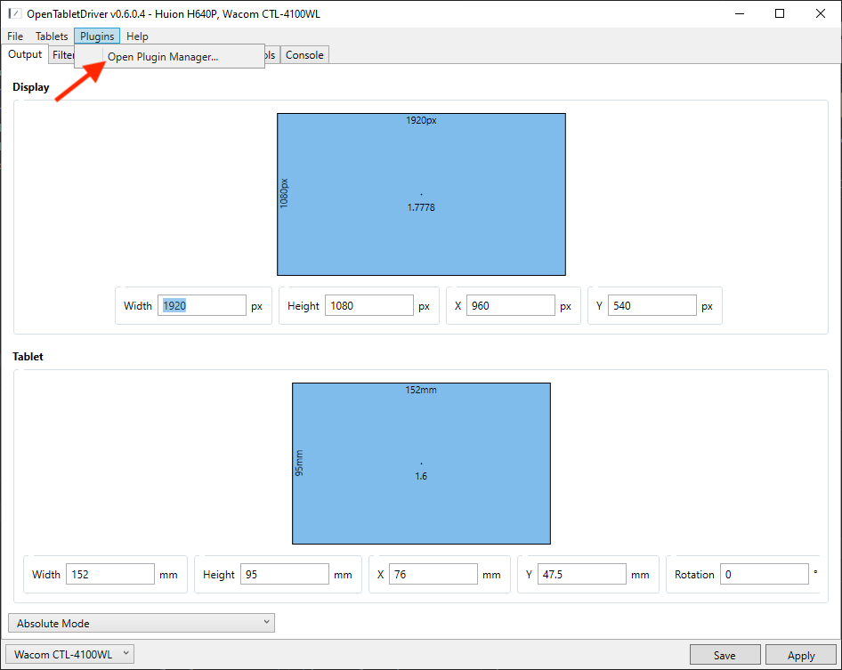
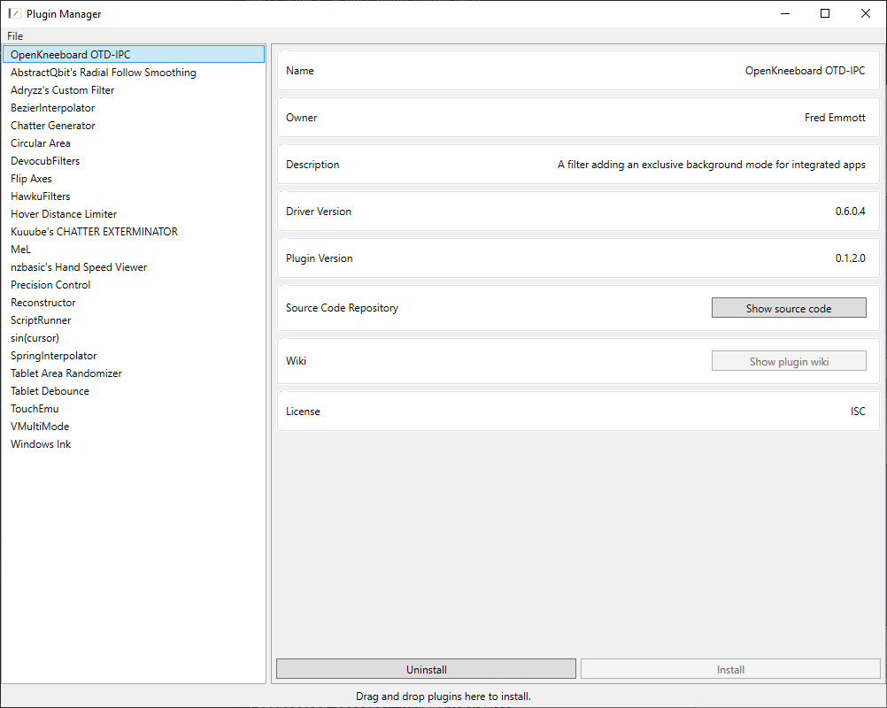
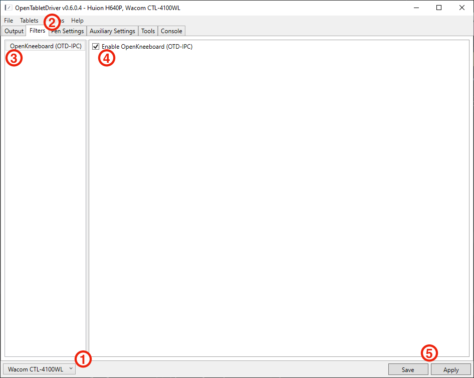

# Getting Started

## Bluetooth users

OpenTabletDriver does not support bluetooth, so if you are using a bluetooth tablet, you must connect it via USB. Even if it shows up in the list in OpenTabletDriver, it will not work correctly. This can not be changed by OTD-IPC or OpenKneeboard.

## Installing OpenTabletDriver

First, remove any other tablet drivers; this includes any drivers from:
- Wacom
- Huion
- VRKneeboard

[TabletDriverCleanup](https://github.com/X9VoiD/TabletDriverCleanup) is a useful tool to make sure previous drivers have been completely removed.

Once you have removed other tablet drivers, [install OpenTabletDriver](https://opentabletdriver.net/Wiki/Install/Windows), and configure your tablet however you want it outside of OpenKneeboard.

## Installing OpenKneeboard OTD-IPC

Download `OpenKneeboard-OTC-IPC-vVERSION.zip` from [the latest release](https://github.com/OpenKneeboard/OTD-IPC/releases/latest) - but don't unzip it.

Open OpenTabletDriver, then open it's plugin manager:

Drag-and-drop the OpenKneeboard-OTC-IPC .zip from your Downloads folder to the plugin manager Window; you should then see "OpenKneeboard OTD-IPC" in the list on the left, and when you click it, you should see something like this:

Finally, close the plugin manager window.

## Enabling OpenKneeboard OTD-IPC

1. Select the tablet you want to use with OpenKneeboard in the bottom left
2. Switch to the filters tab
3. Select OpenKneeboard
4. Tick the 'Enable OpenKneeboard (OTD-IPC)' box
5. Click both 'Save' *AND* 'Apply'; if you do not click 'Save', OpenTabletDriver will not load OTD-IPC when it next starts

Repeat these steps for each tablet that you want to use with OpenKneeboard.

When OpenKneeboard (or another application using OTD-IPC) is active, everything you do with the tablet will be sent to OpenKneeboard instead of your usual OpenTabletDriver output and bindings.

OpenTabletDriver is only active while OpenTabletDriver is running; if you close OpenTabletDriver, your tablet will not work in game or in the OpenKneeboard window. You might want OpenTabletDriver [to automatically start](https://opentabletdriver.net/Wiki/FAQ/Windows#startup).
